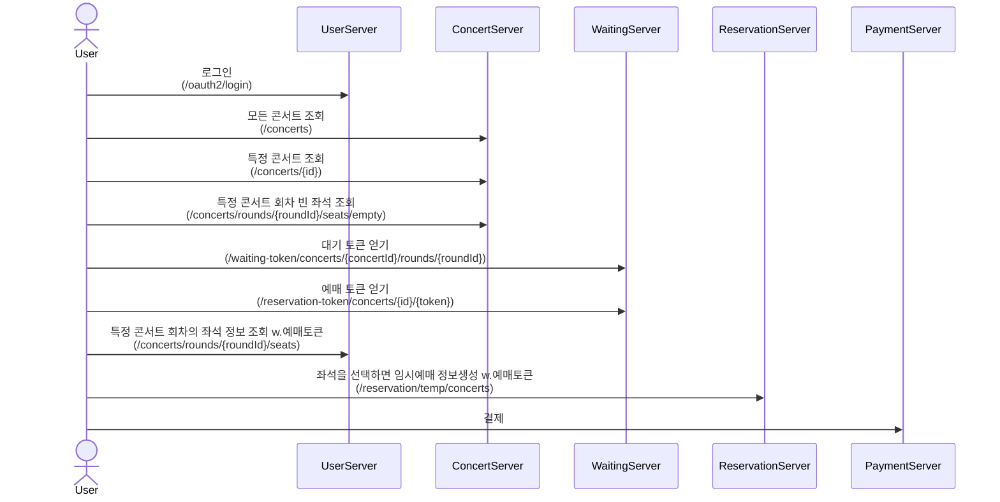

# 유저가 예매를 하는 시나리오
### 상세 flow는 각 서비스 하위의 readme.md를 참고하자

서비스
auth-service
: 권한 서버(Authorization)

[user-service](https://github.com/plere/ticketing/blob/main/services/user-service/readme.md)
: 사용자 서버

[concert-service](https://github.com/plere/ticketing/blob/main/services/concert-service/readme.md)
: 콘서트 및 좌석 서버

waiting-service
: 트래픽이 몰려 처리가능한 범위를 넘어섰을 경우 토큰을 통한 순차적으로 처리하도록 하는 대기열 서버

[reservation-service](https://github.com/plere/ticketing/blob/main/services/reservation-service/readme.md)
: 실제적으로 좌석을 선점하고 예매하는 서버

payment-service
: 결제 서버

