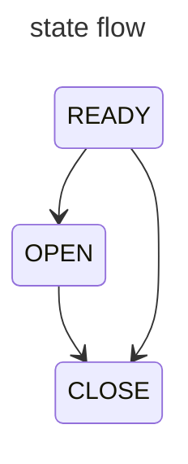

# Concert-service
### 상태 
- READY
  - 기본값
  - 기본적인 값만 작성한 상태
- OPEN 
  - user에게 노출할 수 있는 상태
- CLOSE
  - 더 이상 서비스를 제공하지 않을 상태

### 상태 변경
READY -> OPEN
- 상태가 READY이면서 openTime이 지났으면 스케줄러가 상태 변경

READY/OPEN -> CLOSE
- Admin User가 직접 CLOSE로 변경