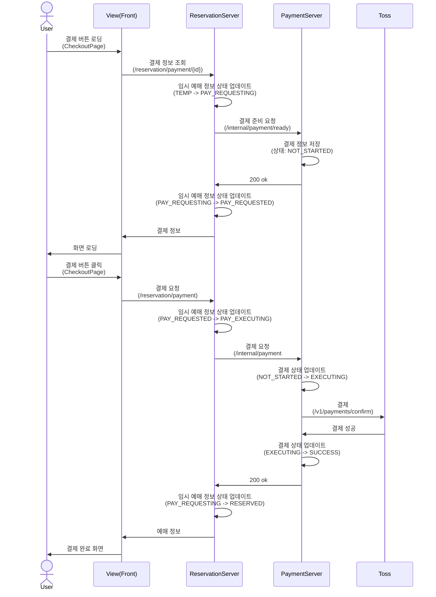

# 결제 flow

```mermaid
sequenceDiagram
actor User
participant View(Front)
participant ReservationServer
participant PaymentServer
 participant Toss

    User->>View(Front): 결제 버튼 로딩<br />(CheckoutPage)
    View(Front)->>ReservationServer: 결제 정보 조회<br />(/reservation/payment/{id})
    ReservationServer->>ReservationServer: 임시 예매 정보 상태 업데이트<br />(TEMP -> PAY_REQUESTING)
    ReservationServer->>PaymentServer: 결제 준비 요청<br />(/internal/payment/ready)
    PaymentServer->>PaymentServer: 결제 정보 저장<br />(상태: NOT_STARTED)
    PaymentServer->>ReservationServer: 200 ok
    ReservationServer->>ReservationServer: 임시 예매 정보 상태 업데이트<br />(PAY_REQUESTING -> PAY_REQUESTED)
    ReservationServer->>View(Front): 결제 정보
    View(Front)->>User: 화면 로딩
    User->>View(Front): 결제 버튼 클릭<br />(CheckoutPage)
    View(Front)->>ReservationServer: 결제 요청<br />(/reservation/payment)
    ReservationServer->>ReservationServer: 임시 예매 정보 상태 업데이트<br />(PAY_REQUESTED -> PAY_EXECUTING)
    ReservationServer->>PaymentServer: 결제 요청<br />(/internal/payment
    PaymentServer->>PaymentServer: 결제 상태 업데이트<br />(NOT_STARTED -> EXECUTING)
    PaymentServer->>Toss: 결제<br />(/v1/payments/confirm)
    Toss->>PaymentServer: 결제 성공
    PaymentServer->>PaymentServer: 결제 상태 업데이트<br />(EXECUTING -> SUCCESS)
    PaymentServer->>ReservationServer: 200 ok
    ReservationServer->>ReservationServer: 임시 예매 정보 상태 업데이트<br />(PAY_REQUESTING -> RESERVED)
    ReservationServer->>View(Front): 예매 정보
    View(Front)->>User: 결제 완료 화면

```
