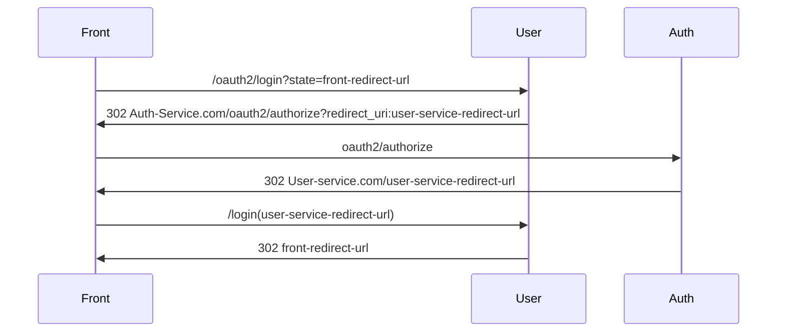

# User-service

### login flow 

```mermaid
    sequenceDiagram
    Front->>User: /oauth2/login?state=front-redirect-url
    User->>Front: 302 Auth-Service.com/oauth2/authorize?redirect_uri:user-service-redirect-url 
    Front->>Auth: oauth2/authorize
    Auth->>Front: 302 User-service.com/user-service-redirect-url
    Front->>User: /login(user-service-redirect-url)
    User->>Front: 302 front-redirect-url
```
- 회원가입을 user에서 하는 이유
  - 편의를 위해서 db를 분리하지 않고 auth-service와 user-service가 db를 같이 쓰고 있기 때문이다
  