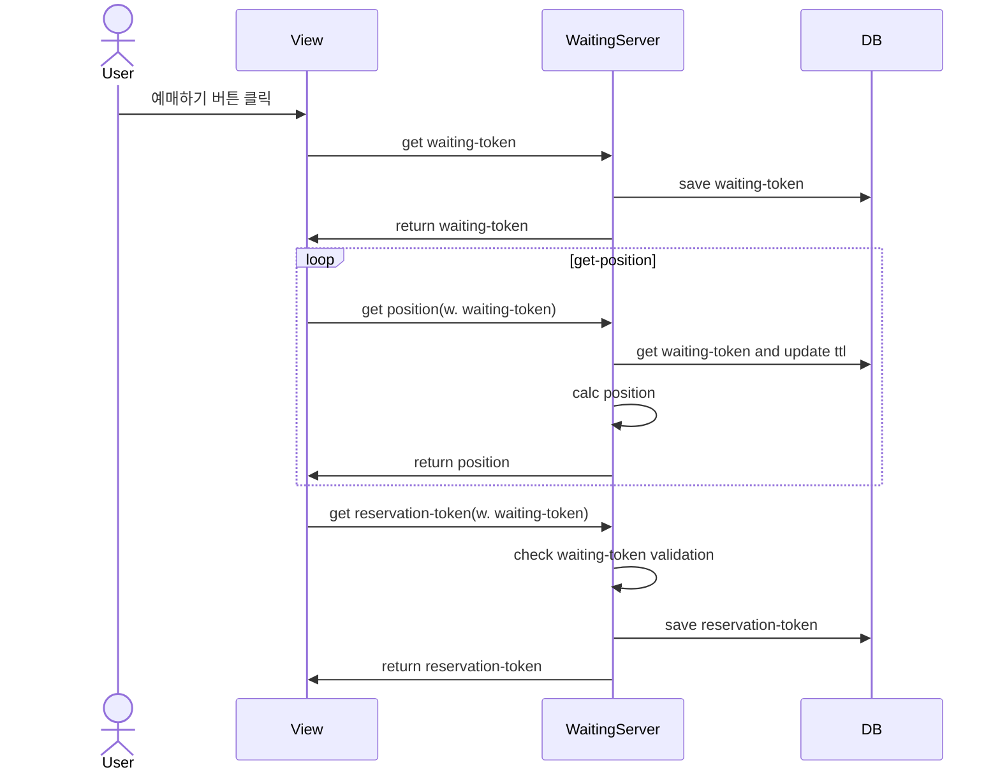
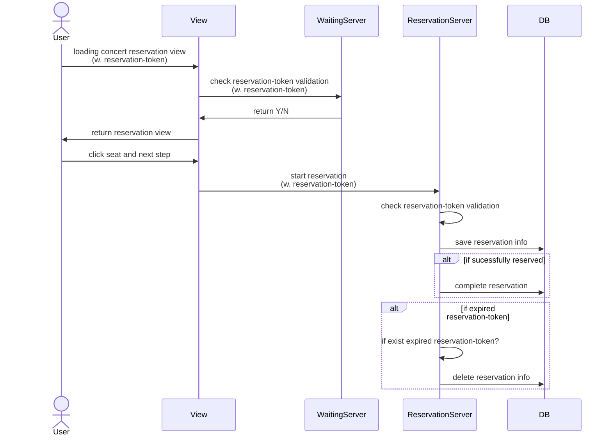

### 대기열 확인 후 예매 토큰 얻는 과정

```mermaid
sequenceDiagram
actor User
participant View
participant WaitingServer
participant DB

    User->>View: 예매하기 버튼 클릭
    View->>WaitingServer: get waiting-token
    WaitingServer->>DB: save waiting-token
    WaitingServer->>View: return waiting-token

    loop get-position
        View->>WaitingServer: get position(w. waiting-token)
        WaitingServer->>DB: get waiting-token and update ttl
        WaitingServer->>WaitingServer: calc position
        WaitingServer->>View: return position    
    end

    View->>WaitingServer: get reservation-token(w. waiting-token)
    WaitingServer->>WaitingServer: check waiting-token validation
    WaitingServer->>DB: save reservation-token
    WaitingServer->>View: return reservation-token
```

### 예매토큰으로 예매

```mermaid
sequenceDiagram
actor User
participant View
participant WaitingServer
participant ReservationServer
participant DB

    User->>View: loading concert reservation view<br/>(w. reservation-token)
    View->>WaitingServer: check reservation-token validation<br/>(w. reservation-token)
    WaitingServer->>View: return Y/N
    View->>User: return reservation view
    User->>View: click seat and next step
    View->>ReservationServer: start reservation<br/>(w. reservation-token)
    ReservationServer->>ReservationServer: check reservation-token validation
    ReservationServer->>DB: save reservation info
    alt if sucessfully reserved
        ReservationServer->>DB: complete reservation
    end

    alt if expired reservation-token
        ReservationServer->>ReservationServer: if exist expired reservation-token?
        ReservationServer->>DB: delete reservation info
    end

```